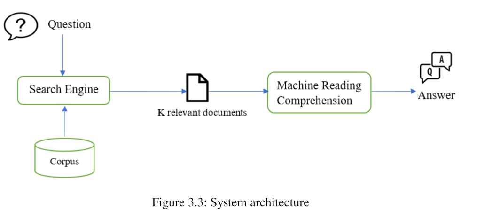
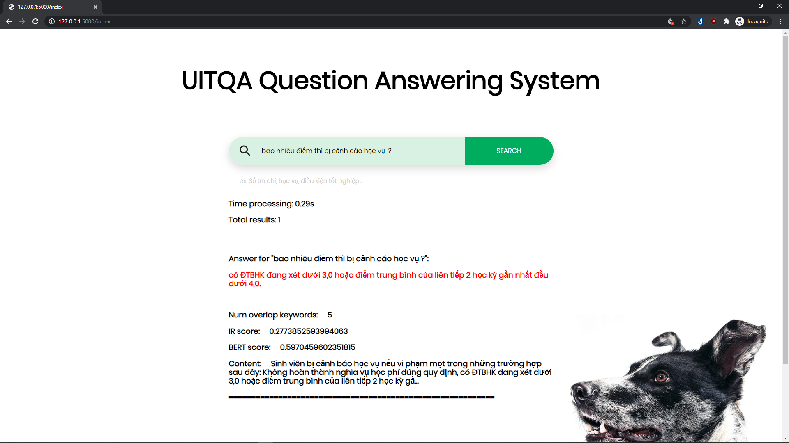

# UITQA-UIT-Question-Answering

A system with a search engine for relevant document retrieval (TF-IDF) and a deep learning model (BERT), applied to answer questions related to regulations of University of Information Technology (UIT)

This project is referenced from [UITHelper_QAS][1] and [Vietnamese question answering with BERT][2]

# To run
1. `pip install -r requirements.txt`

2. Download [my pre-train model][3] and put all file into 'model' directory

3. run cmd `py app.py`

4. go to http://127.0.0.1:5000 

# Train with custom data on BERT question answering
The training and testing data include: Vietnamese question-answer pairs from Wikipedia and Vietnamese question-answer pairs from UIT regulation documents which must be in [SQUADv1.1-like format][5]. You can find it [here][4]
  
  

<li>Follow my steps in google_colab/Fine_Tunning_BERT.ipynb

<li>Please note that change the path to your train set and test set

# System architecture
 

# For example
 

[1]: https://github.com/namnv1113/UITHelper_QAS#general

[2]: https://github.com/mailong25/bert-vietnamese-question-answering

[3]: https://drive.google.com/drive/folders/1MdY-TdDVFdhXQSHU3lPU6oPV3Ndv776V?usp=sharing

[4]: https://github.com/namnv1113/UITHelper_QAS/tree/master/Dataset

[5]: https://rajpurkar.github.io/SQuAD-explorer/

